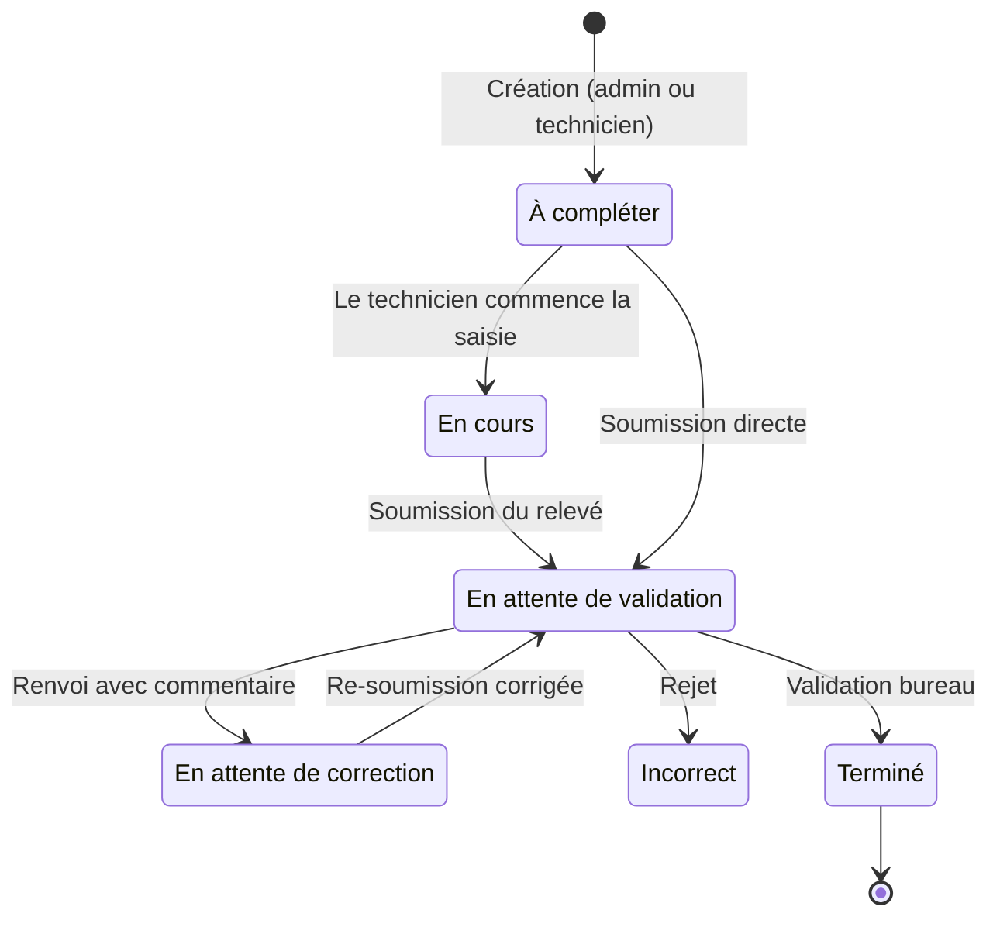
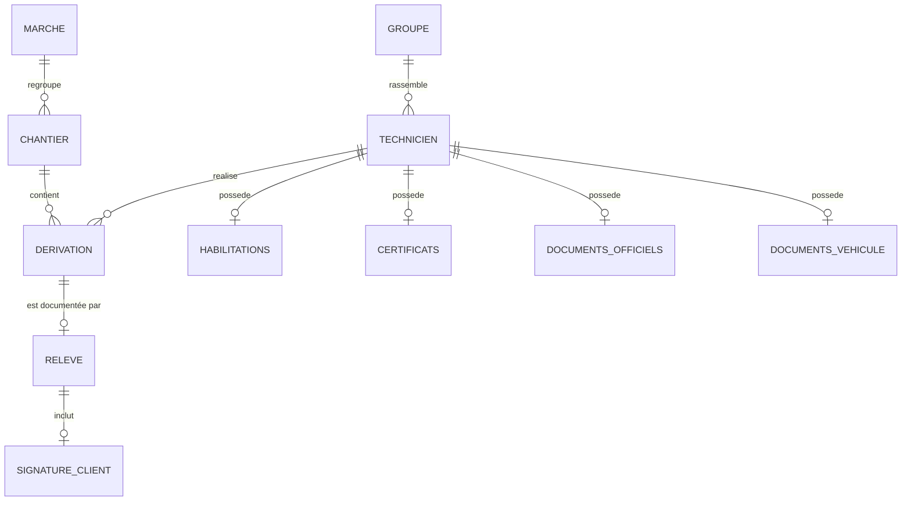

# Cahier des charges — Abrisûr Software (Bathelec)

**Plateforme de gestion des relevés de dérivation et des opérations terrain**

| | |
|---|---|
| Projet | Abrisûr Software (monorepo `bathelec-software`) |
| Version du document | 1.1 |
| Date | 20 juillet 2026 |
| Statut | Rédigé à partir de l'existant (rétro-spécification) |

---

## 1. Contexte et présentation du projet

### 1.1 Contexte métier

Bathelec est une entreprise d'électricité intervenant en sous-traitance pour **Enedis** (gestionnaire du réseau de distribution d'électricité en France). Son cœur d'activité couvert par ce projet est la réalisation de **dérivations individuelles** : travaux de raccordement ou de remplacement de la liaison entre la colonne montante d'un immeuble et le compteur d'un client (remplacement de câble, pose de compteur Linky, remplacement de disjoncteur, etc.).

Ces interventions sont réalisées par des **techniciens électriciens** sur des **chantiers** (immeubles, adresses) rattachés à des **marchés** Enedis (Directions Régionales, ex. « DR Paris », « DR Île-de-France »). Chaque intervention doit faire l'objet d'un **relevé de fin de travaux** détaillé : photos avant et après, index des compteurs, caractéristiques du câble posé et du disjoncteur, et validation du client avec signature.

Historiquement gérés sur papier, ces relevés posent des problèmes de traçabilité, de perte d'information, de délai de transmission au bureau et de contrôle qualité. Le projet **Abrisûr Software** digitalise l'ensemble de ce processus.

### 1.2 Objectifs du projet

1. **Digitaliser le relevé de dérivation** : remplacer la fiche papier par un formulaire numérique guidé, utilisable sur le terrain (mobile-first), avec capture de photos et signature du client sur écran.
2. **Fiabiliser le contrôle qualité** : instaurer un circuit de validation bureau (revue, demande de correction, validation finale) avec traçabilité des statuts.
3. **Piloter l'activité** : offrir au bureau une vue temps réel de l'avancement des chantiers et des relevés (tableau de bord, indicateurs par statut).
4. **Centraliser le dossier du technicien** : habilitations électriques (NF C 18-510), titres et certificats (SS4 amiante, plomb, SST), documents officiels (pièce d'identité, carte BTP, mutuelle) et documents du véhicule (carte grise, permis).
5. **Structurer le référentiel opérationnel** : marchés, chantiers (avec numéros d'affaire Enedis et internes), équipes de techniciens.
6. **Rester exploitable sur le terrain** : concevoir l'application en « local-first » pour qu'elle fonctionne même en environnement peu ou pas couvert par le réseau, avec synchronisation différée dès le retour de la connexion.
7. **Faciliter la transmission à Enedis** : produire un export de la fiche de dérivation au format Excel conforme aux normes de reporting attendues par Enedis.

### 1.3 Périmètre

**Inclus :**

- Application web responsive (usage bureau pour les administrateurs, usage mobile pour les techniciens).
- Fonctionnement local-first, utilisable hors-ligne, avec synchronisation différée.
- Gestion des comptes utilisateurs, rôles et groupes de techniciens.
- Référentiel marchés et chantiers.
- Cycle de vie complet du relevé de dérivation (création, saisie terrain, soumission, revue, correction, validation).
- Export de la fiche de dérivation au format Excel selon les normes Enedis.
- Dossier administratif du technicien (habilitations, documents).
- Page numéros d'urgence (sécurité chantier).

**Exclus (hors périmètre de la version actuelle) :**

- Facturation, devis, paie.
- Planification et prise de rendez-vous client.
- Application mobile native (le web mobile couvre le besoin).
- Interfaçage automatisé et direct avec les systèmes d'information Enedis (la transmission se fait par export de fichier).

---

## 2. Acteurs et rôles

### 2.1 Administrateur (bureau)

Personnel du bureau d'études et d'encadrement. Il :

- gère les comptes utilisateurs (création de techniciens, modification, suppression, attribution des rôles),
- gère les groupes de techniciens (équipes),
- crée les marchés et les chantiers,
- crée et affecte les relevés de dérivation aux techniciens,
- contrôle les relevés soumis (validation, demande de correction avec commentaire, ou rejet),
- gère les habilitations et certificats de chaque technicien (activation des codes NF C 18-510, pièces justificatives),
- consulte les documents officiels et véhicule de tous les techniciens,
- suit l'activité via le tableau de bord (indicateurs, graphique de répartition par statut, liste filtrable des relevés).

### 2.2 Technicien (terrain)

Électricien intervenant sur chantier. Il :

- consulte les chantiers en cours et terminés, organisés par marché,
- complète les relevés de dérivation qui lui sont affectés (formulaire multi-étapes) ou en crée pour lui-même,
- corrige un relevé renvoyé par le bureau,
- gère son propre dossier (documents officiels, documents véhicule),
- consulte en lecture seule ses habilitations et certificats,
- accède aux numéros d'urgence.

### 2.3 Client final (acteur externe, sans compte)

L'occupant ou propriétaire chez qui l'intervention est réalisée. Il n'a pas d'accès à l'application, mais intervient dans le processus : présence constatée, validation des travaux, note de satisfaction, commentaire et **signature sur l'écran du technicien**.

### 2.4 Matrice des droits (synthèse)

| Fonctionnalité | Admin | Technicien |
|---|---|---|
| Tableau de bord global des dérivations | ✔ | ✘ |
| Créer, modifier, supprimer utilisateurs et groupes | ✔ | ✘ |
| Créer marchés et chantiers | ✔ | ✘ |
| Créer un relevé de dérivation | ✔ (pour tout technicien) | ✔ (pour lui-même uniquement) |
| Remplir ou corriger un relevé | ✘ (lecture seule) | ✔ (les siens) |
| Valider ou rejeter un relevé soumis | ✔ | ✘ |
| Exporter une fiche de dérivation au format Excel | ✔ | ✔ (les siens) |
| Gérer les habilitations d'un technicien | ✔ | Consultation seule (les siennes) |
| Documents officiels et véhicule | Consultation de tous | Gestion des siens |
| Changer son mot de passe | ✔ | ✔ |

---

## 3. Vocabulaire métier (glossaire)

| Terme | Définition |
|---|---|
| **Marché** | Contrat-cadre régional Enedis regroupant des chantiers (ex. « DR Paris », « DR Île-de-France »). |
| **Chantier** | Site d'intervention physique (adresse), rattaché à un marché, identifié par un **numéro d'affaire Enedis** (ex. `DC21/014312`) et un **numéro d'affaire interne** (ex. `BA570035`). |
| **Dérivation** | Ordre de travail : intervention de raccordement ou de remplacement de la dérivation individuelle d'un logement, affectée à un technicien sur un chantier. |
| **Relevé de dérivation** (formulaire d'intervention) | Compte rendu numérique de fin de travaux : informations client, photos avant et après, ancien et nouveau compteur, câble posé, disjoncteur, validation client avec signature. |
| **Folio** | Référence du dossier logement (ex. `SGX001 - COM001 - ASC001 - 001 - 101`). |
| **CM / Identification CM** | Colonne montante : identification de la platine de comptage (ex. `1D001`, `2C101`). |
| **Linky** | Compteur communicant Enedis, générations G1, G2 et G3. |
| **Index HP / HC** | Relevés de consommation heures pleines (jour) et heures creuses (nuit). |
| **Habilitation NF C 18-510** | Autorisation légale de travail électrique (B0, BS, B1, B1V, B2, BC, BR, H0, H1, H2, HC, etc.). |
| **Titres & certificats** | Certifications complémentaires : titre d'habilitation électrique, SS4 (amiante sous-section 4), plomb, SST (Sauveteur Secouriste du Travail). |
| **Groupe de techniciens** | Équipe nommée regroupant plusieurs techniciens. |

---

## 4. Exigences fonctionnelles

### 4.1 Authentification et gestion de compte

- **EF-AUTH-01** — Connexion par nom d'utilisateur et mot de passe, avec session sécurisée par jeton (JWT en cookie httpOnly). Message d'erreur générique en cas d'échec.
- **EF-AUTH-02** — Redirection automatique vers l'espace correspondant au rôle (admin ou technicien). Un utilisateur ne peut pas accéder à l'espace de l'autre rôle.
- **EF-AUTH-03** — Déconnexion depuis le menu profil.
- **EF-AUTH-04** — Consultation du profil (prénom, nom, email, nom d'utilisateur, date d'inscription).
- **EF-AUTH-05** — Changement de mot de passe avec saisie de l'ancien mot de passe. Politique : 8 caractères minimum, une majuscule, une minuscule, un chiffre et un caractère spécial.
- **EF-AUTH-06** — Les nouveaux comptes créés via l'inscription sont toujours des techniciens. Le rôle administrateur est attribué manuellement par un administrateur.

### 4.2 Gestion des utilisateurs et des groupes (admin)

- **EF-USR-01** — Liste de tous les utilisateurs (ID, nom d'utilisateur, email, prénom, nom, rôle, date de création) avec compteur.
- **EF-USR-02** — Liste dédiée des techniciens, avec accès rapide à la gestion de leurs habilitations.
- **EF-USR-03** — Création d'un compte technicien (prénom, nom, email, nom d'utilisateur, mot de passe et confirmation).
- **EF-USR-04** — Modification d'un utilisateur (identité, email, rôle Administrateur ou Technicien) et suppression avec confirmation.
- **EF-USR-05** — Gestion des groupes de techniciens : création (nom, description), modification, suppression, ajout et retrait de membres, recherche.
- **EF-USR-06** — Export CSV des listes d'utilisateurs et de techniciens *(bouton présent, logique d'export à finaliser — voir section 7)*.

### 4.3 Référentiel marchés et chantiers

- **EF-REF-01** — Création d'un marché (nom unique, ex. « Marché IDF 2026 »), réservée à l'administrateur.
- **EF-REF-02** — Création d'un chantier rattaché à un marché : adresse, numéro d'affaire Enedis, numéro d'affaire interne. Réservée à l'administrateur.
- **EF-REF-03** — Calcul automatique de l'état d'un chantier à partir de ses dérivations : **À démarrer** (aucune dérivation), **En cours** (au moins une dérivation non terminée), **Terminé** (toutes les dérivations terminées).
- **EF-REF-04** — Navigation par arborescence : marché (dossier) puis chantiers (tableau) puis dérivations (tableau), avec vues séparées « Chantiers en cours » et « Chantiers terminés ».

### 4.4 Cycle de vie du relevé de dérivation (processus central)

#### Statuts

| Statut interne | Libellé métier | Signification |
|---|---|---|
| Pending | **À compléter** | Relevé créé, en attente de saisie par le technicien. |
| Ongoing | **En cours** | Saisie commencée, non soumise. |
| Reviewing | **En attente de validation** | Soumis par le technicien, à contrôler par le bureau. |
| Revising | **En attente de correction** | Renvoyé au technicien avec un commentaire de correction. |
| Incorrect | **Incorrect** | Rejeté par le bureau. |
| Completed | **Terminé** | Validé par le bureau. |

#### Processus

1. **Création** (EF-DER-01) : un admin crée une dérivation en affectant un technicien et un chantier. Un technicien peut aussi créer un relevé pour lui-même. Statut initial : *À compléter*.
2. **Saisie terrain** (EF-DER-02) : le technicien remplit le formulaire multi-étapes (voir section 4.5). Les actions proposées dépendent du statut : « Compléter » (à compléter), « Continuer » (en cours), « Corriger » (en attente de correction), « Voir » (autres cas).
3. **Soumission** (EF-DER-03) : à la soumission du formulaire, le relevé passe automatiquement en *En attente de validation*. Le formulaire devient alors non modifiable par le technicien.
4. **Contrôle bureau** (EF-DER-04) : l'admin consulte le relevé en lecture seule et statue via le panneau « Correction », en le passant en **Terminé**, **En attente de correction** (avec commentaire de correction obligatoire pour guider le technicien) ou **Incorrect**.
5. **Correction** (EF-DER-05) : en cas de renvoi, le technicien voit le commentaire de correction, modifie sa saisie et resoumet, ce qui ramène le relevé en *En attente de validation*.
6. **Clôture** (EF-DER-06) : une fois toutes les dérivations d'un chantier au statut *Terminé*, le chantier bascule dans « Chantiers terminés ».

### 4.5 Formulaire d'intervention (relevé en 9 étapes)

Formulaire guidé avec barre de progression, pensé pour un usage sur smartphone. Certaines étapes sont automatiquement sautées selon les réponses (compteur conservé, refus de Linky), pour un total de 7 à 9 étapes effectives.

1. **Informations client** : nom (majuscules), téléphone (format FR), folio.
2. **Informations générales** : date et heure, technicien réalisateur, adresse du chantier (rue verrouillée depuis le chantier, code postal 5 chiffres, ville), bâtiment, identification CM, étage (RDC à 20), situation sur le palier (gauche, droite, en face, face gauche, face droite, autre), commentaire.
3. **Photo avant travaux** : vue d'ensemble de la platine de comptage (obligatoire).
4. **Ancien compteur** : type (électromécanique, CBE, Linky, autre), génération si Linky (SBE, G1, G2, G3), indicateurs **Conservé** et **Refus de Linky**, matricule (3 chiffres), clé (2 chiffres), index jour HP et nuit HC, photo du relevé d'index (obligatoire).
5. **Nouvelle dérivation** : section posée (2x16, 2x25 ou 2x35 mm²), nature du câble (cuivre ou aluminium), longueur posée en mètres. **Règle de cohérence** : alerte si la longueur dépasse 10 m en 2x16 ou 20 m pour les autres sections (« Merci de confirmer la section, et de vérifier par rapport au projet »).
6. **Nouveau compteur** *(sautée si l'ancien compteur est conservé)* : génération, matricule (3 chiffres, aide visuelle), index jour et nuit, photo avec index visible (obligatoire).
7. **Disjoncteur** : consigne de sécurité affichée (test du bouton avant travaux, remplacement obligatoire sinon). Champs : conservé, voltage (mono ou tri), marque (BACO, GE, Schneider…), type (non différentiel, différentiel, sélectif), puissance, mise en service effectuée, **plombage obligatoire dans tous les cas**.
8. **Photo après travaux** : vue d'ensemble (obligatoire) et jusqu'à 2 photos complémentaires facultatives.
9. **Validation client** : présence du client (présent ou absent).
   - Si le client est présent : validation des travaux, niveau de satisfaction (échelle de 0 à 4 étoiles), commentaire client et signature sur écran (avec effacement possible).
   - Dans tous les cas : commentaire de l'électricien (obligatoire).

Contraintes transverses : les photos sont aux formats JPEG, PNG ou WebP, avec une taille limitée à environ 4 à 5 Mo par image. Le relevé complet (photos et signature incluses) est conservé de façon intègre et rattaché à la dérivation.

### 4.6 Tableau de bord administrateur

- **EF-DASH-01** — Cartes d'indicateurs : nombre de dérivations par statut.
- **EF-DASH-02** — Graphique circulaire de répartition des statuts avec total au centre.
- **EF-DASH-03** — Liste des relevés : recherche, filtres par technicien et par statut, pagination (5, 10, 20 ou 50). Colonnes : ID, date de création, technicien, chantier, statut, action. Les relevés « En attente de validation » sont mis en avant avec un bouton « À vérifier ».

### 4.7 Dossier du technicien

#### Habilitations NF C 18-510 (EF-HAB)

- Matrice basse tension et haute tension, opérations d'ordre électrique et non électrique, couvrant 20 codes répartis par rôle :
  - Non-électricien : B0, BS, BE, H0, H0V.
  - Exécutant : B1, B1V, H1, H1V.
  - Chargé de travaux : B2, B2V, B2V essais, H2, H2V, H2V essais.
  - Chargé de consignation : BC, HC.
  - Chargé d'intervention : BR.
  - Chargé d'opérations spécifiques : BE et HE avec attribut (essais, mesurages, vérifications).
- Attribution et retrait par l'administrateur uniquement. Le technicien consulte les siennes en lecture seule (badge vert pour habilité, grisé barré pour non habilité).
- Les habilitations ne peuvent être portées que par des comptes techniciens.

#### Titres et certificats (EF-CERT)

- Quatre certifications, chacune avec un indicateur actif ou inactif et une pièce justificative jointe (image ou PDF) : titre d'habilitation électrique, titre SS4 (amiante sous-section 4), titre plomb, certificat SST.
- Actions administrateur : joindre, remplacer, prévisualiser ou supprimer le justificatif. États affichés : « Document disponible », « Pas de document », « Non attribuée ».

#### Documents officiels (EF-DOC)

- Le technicien téléverse et met à jour lui-même : pièce d'identité ou titre de séjour, carte Pro du BTP, carte mutuelle (PRO BTP).
- Consultation par le technicien (les siens) et par les admins (tous).

#### Documents véhicule (EF-VEH)

- Carte grise et permis de conduire, sur le même modèle que les documents officiels.

### 4.8 Sécurité chantier

- **EF-URG-01** — Page « Numéros d'urgence » accessible aux techniciens : SAMU (15), Police et Gendarmerie (17), Pompiers (18), numéro européen (112), avec appel en un clic depuis le mobile et rappel de la conduite à tenir en cas de danger sur chantier.

### 4.9 Export de la fiche de dérivation (format Excel, normes Enedis)

- **EF-EXP-01** — Depuis une fiche de dérivation complétée, l'utilisateur peut générer un export au format Excel (.xlsx) reprenant l'intégralité des informations du relevé.
- **EF-EXP-02** — Le fichier exporté respecte le format et les normes de reporting utilisés par Enedis. Sont notamment repris, dans l'ordre et avec les intitulés attendus :
  - le numéro d'affaire Enedis et le numéro d'affaire interne,
  - le folio et l'identification CM (colonne montante),
  - les informations client et l'adresse complète du chantier,
  - le type, la génération et le matricule des anciens et nouveaux compteurs,
  - les index HP et HC relevés,
  - la section, la nature et la longueur du câble posé,
  - les caractéristiques du disjoncteur (voltage, marque, type, puissance, mise en service, plombage),
  - la validation client (présence, satisfaction, commentaire).
- **EF-EXP-03** — Les unités et codifications (sections en mm², puissances en ampères, générations Linky, etc.) suivent la nomenclature Enedis afin de rendre l'export directement transmissible ou archivable, sans ressaisie.
- **EF-EXP-04** — L'export peut porter sur une fiche unique ou sur l'ensemble des dérivations d'un chantier (export groupé).

---

## 5. Règles de gestion (synthèse)

| Réf. | Règle |
|---|---|
| RG-01 | Une dérivation est toujours affectée à un technicien, et un technicien ne peut créer une dérivation que pour lui-même. |
| RG-02 | La soumission (ou la re-soumission) d'un relevé place systématiquement la dérivation en « En attente de validation ». |
| RG-03 | Seul un admin peut faire passer un relevé en « Terminé », « En attente de correction » ou « Incorrect ». |
| RG-04 | Un relevé aux statuts « Terminé », « En attente de validation » ou « Incorrect » est en lecture seule pour le technicien. |
| RG-05 | Un chantier est « Terminé » uniquement lorsque toutes ses dérivations sont « Terminé ». |
| RG-06 | Le plombage du disjoncteur est obligatoire dans tous les cas. |
| RG-07 | Si l'ancien compteur est conservé, l'étape « Nouveau compteur » est omise. |
| RG-08 | Alerte de cohérence câble : longueur inférieure ou égale à 10 m en section 2x16, et à 20 m sinon. |
| RG-09 | Les photos avant travaux, du relevé d'index de l'ancien compteur, de l'index du nouveau compteur (si posé) et après travaux sont obligatoires. |
| RG-10 | Le commentaire de l'électricien est obligatoire à la validation finale du formulaire. La signature client n'est requise que si le client est présent. |
| RG-11 | Habilitations et certificats ne s'attachent qu'à des comptes de rôle « technicien ». |
| RG-12 | Un renvoi en correction doit être accompagné d'un commentaire de correction visible par le technicien. |
| RG-13 | Chaque technicien ne possède qu'un seul dossier de chaque type (habilitations, certificats, documents officiels, documents véhicule), mis à jour et non dupliqué. |
| RG-14 | L'export Excel d'une fiche de dérivation reflète l'état des données au moment de l'export et respecte la nomenclature Enedis. |

---

## 6. Exigences non fonctionnelles

- **ENF-01 Ergonomie** — Interface entièrement en français.
  - Espace technicien optimisé pour le mobile (grille de cartes, gros boutons, appel téléphonique direct).
  - Espace administrateur optimisé pour le bureau (tableaux, filtres, tableau de bord).
- **ENF-02 Sécurité** :
  - Authentification par jeton signé et mots de passe hachés (bcrypt).
  - Contrôle des droits systématique côté serveur (administrateur ou propriétaire de la ressource).
  - Validation des entrées côté client et côté serveur.
  - Secrets conservés hors du code source.
- **ENF-03 Confidentialité** — Les documents personnels (pièces d'identité, signatures, photos) ne sont accessibles qu'à leur propriétaire et aux administrateurs.
- **ENF-04 Traçabilité** — Horodatage de la création des relevés et conservation des commentaires de correction.
- **ENF-05 Disponibilité des données** — Les relevés soumis (photos et signature comprises) sont conservés de manière durable et consultables à tout moment par le bureau.
- **ENF-06 Volumétrie** — Images limitées à environ 4 à 5 Mo, formats JPEG, PNG ou WebP (PDF accepté pour les justificatifs d'habilitation).
- **ENF-07 Documentation technique** — API documentée (Swagger) pour faciliter la maintenance et d'éventuelles intégrations futures.
- **ENF-08 Local-first et fonctionnement hors-ligne** — L'application est conçue selon une approche « local-first ». Les données saisies sur le terrain sont d'abord enregistrées localement sur l'appareil du technicien, ce qui garantit son utilisation même en l'absence de réseau ou en réseau faible. La synchronisation avec le serveur s'effectue automatiquement dès que la connexion est rétablie, sans perte de données ni ressaisie. Les conflits de synchronisation sont gérés de manière à préserver les données du terrain.

---

## 7. Limites actuelles et évolutions envisagées

Fonctionnalités identifiées comme incomplètes ou candidates pour une version ultérieure :

1. **Export PDF du relevé de dérivation** — le relevé est un document contractuel (signature client). Un export PDF transmissible à Enedis ou archivable est une évolution naturelle, complémentaire de l'export Excel décrit en section 4.9. *(Absent aujourd'hui.)*
2. **Export CSV des utilisateurs et techniciens** — boutons présents dans l'interface mais non câblés.
3. **« Top Chantiers »** — page annoncée côté technicien (classement des meilleurs chantiers), actuellement en attente de spécification.
4. **Réinitialisation de mot de passe oublié** — inexistante à ce jour. Seul le changement de mot de passe connecté est possible. À prévoir (lien par email).
5. **Notifications** — aucun email ni notification push (par exemple prévenir un technicien d'un renvoi en correction, ou prévenir le bureau d'une soumission).
6. **Gestion des dates d'échéance** — habilitations, certificats et documents (permis, carte BTP…) n'ont pas de date de validité ni d'alerte d'expiration. Fonctionnalité à forte valeur métier pour la conformité réglementaire.
7. **Stockage des fichiers** — les photos et documents sont stockés en base (base64). Une migration vers un stockage de fichiers dédié est recommandée à mesure que la volumétrie croît.
8. **Cycle de vie « En cours »** — le passage du statut « À compléter » à « En cours » mérite d'être formalisé (sauvegarde de brouillon terrain), en cohérence avec l'approche local-first.

---

## 8. Annexes

### A. Diagramme du cycle de vie d'une dérivation

### B. Organisation des données métier

### C. Exemple de références

- Numéro d'affaire Enedis : `DC21/014312`
- Numéro d'affaire interne : `BA570035`
- Folio : `SGX001 - COM001 - ASC001 - 001 - 101`
- Identification CM : `1D001`, `2C101`
